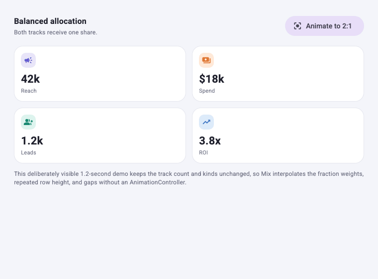
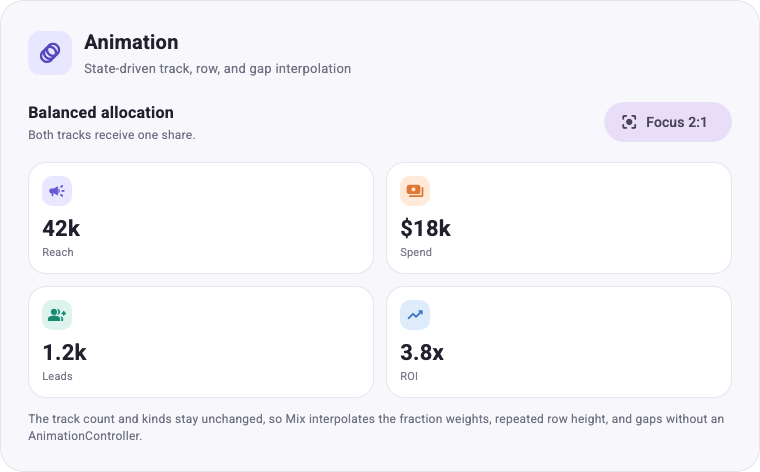
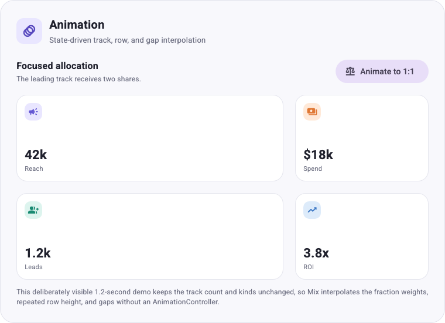

# Grid layout

`GridBox` arranges children in row-major order using fixed, fractional, and
vertical auto tracks. Its style supports ordinary Mix variants and modifiers,
plus `onConstraints` for layout decisions based on the Grid's own available
space.

## Basic usage

For equal-width columns, use `GridBoxStyler.equalColumns` as a dot-shorthand
entry point, then chain the remaining geometry:

```dart
final GridBoxStyler style = .equalColumns(3)
    .gap(16)
    .autoRows(.auto());

GridBox(style: style, children: cards);
```

`GridTrack.fixed(size)` keeps its logical-pixel size and is a hard constraint:
children in a fixed row are stretched or clipped to that height. `GridTrack.fr(fraction)`
receives that fraction of the free space left after fixed tracks, auto tracks,
and gaps. For example, with 300 pixels of remaining space, `[.fr(2), .fr(1)]`
produces tracks of 200 and 100 pixels. Fractional tracks require a bounded
parent extent on their axis. `GridTrack.auto()` is vertical-only: the row
sizes to its tallest child's natural height at the resolved column width.
Use `columns` directly when tracks are intentionally mixed:

```dart
final GridBoxStyler sidebarAndContent = .columns([
  .fixed(240),
  .fr(1),
]);
```

## Responsive containers

`onConstraints` uses the existing `Breakpoint` value but evaluates it against
the bounded maximum size offered to this Grid:

```dart
final GridBoxStyler cardGrid = .equalColumns(3)
    .gap(16)
    .onConstraints(
  .maxWidth(760),
  .equalColumns(2).gap(12),
).onConstraints(
  .maxWidth(520),
  .equalColumns(1).gap(10),
);
```

Matching branches apply in declaration order, so the narrower branch above
overrides the wider branch when both match. A branch can change columns, rows,
`autoRows`, and gaps. It cannot change clipping, modifiers, animations,
ordinary variants, or contain another constraint branch.

Use `onBreakpoint` when a style should respond to the viewport instead:

```dart
final viewportStyle = cardGrid.onBreakpoint(
  .maxWidth(520),
  .columns([.fr(1)]),
);
```

Two GridBoxes on the same screen can therefore select different
`onConstraints` branches when their parent containers offer different widths.

## Rows and auto-placement

Children fill columns from left to right, then continue on the next row.
Provide explicit `rows` for known row geometry, or `autoRows` for each repeated
row needed beyond the explicit list. Omitted `autoRows` defaults to
`GridTrack.auto()`, so a two-column Grid with no row declaration sizes each
implicit row to its tallest child:

```dart
final GridBoxStyler gallery = .equalColumns(2).gap(12);

final GridBoxStyler mixed = .equalColumns(2).rows([
  .fixed(180),
]).autoRows(.auto()).columnGap(12).rowGap(12);
```

With five children and two columns, `mixed` needs three rows: the first uses
the explicit 180-pixel row and the next two repeat `autoRows`. When `rows` is
empty, every required row uses `autoRows` (or `auto` when it is omitted).

Use `GridTrack.auto()` — or omit `autoRows` — in a vertical
`SingleChildScrollView` when child heights are unknown. Auto-row children are
measured at their column width, then laid out again into the stretched cell so
shorter siblings fill the row. That extra measure pass runs only for children
in auto rows; explicit fixed/`fr` Grids still lay each child out once.

Nesting compounds that cost. Each auto-row level measures its subtree and then
lays it out again, so the passes multiply rather than add: a leaf inside one
auto Grid is laid out twice, and inside three nested auto Grids it is laid out
eight times. For deep hierarchies, prefer a single Grid, or give the inner
levels fixed rows once their heights are known.

Fixed rows stay hard heights. Fractional rows and fractional `autoRows` still
require bounded height. Auto rows require children with a finite natural
height; `Expanded`, `Spacer`, or another expanding child inside an auto row
in a scroll view is an error.

`GridTrack.auto()` is rejected on `columns`. Content-sized columns need a
separate two-axis design and are not part of this API.

## Design tokens

Fixed sizes and gaps can use `SpaceToken`; fractional weights can use
`DoubleToken`. Tokens resolve through the surrounding `MixScope` before Grid
geometry is validated, including geometry inside `onConstraints` patches:

```dart
const cardWidth = SpaceToken('grid.card.width');
const gridGap = SpaceToken('grid.gap');
const contentWeight = DoubleToken('grid.content.weight');

final GridBoxStyler tokenGrid = .columns([
  .fixed(cardWidth()),
  .fr(contentWeight()),
]).gap(gridGap()).autoRows(.fixed(cardWidth()));

MixScope(
  spaces: {cardWidth: 160, gridGap: 12},
  doubles: {contentWeight: 2},
  child: GridBox(style: tokenGrid, children: cards),
);
```

## Animation

`animate` provides implicit Grid animation: rebuild with different geometry and
Mix interpolates the resolved `GridBoxSpec` without an `AnimationController`.
For example, this state-driven Grid moves from equal columns to a 2:1 focus
layout while also increasing its row height and gaps:

The runnable gallery uses an intentionally slow 1.2-second duration so every
changing Grid dimension is easy to inspect. Product interfaces can choose a
shorter duration without changing the API.

```dart
final GridBoxStyler animatedGrid = .columns([
  .fr(focused ? 2 : 1),
  .fr(1),
])
    .autoRows(.fixed(focused ? 148 : 112))
    .gap(focused ? 20 : 12)
    .animate(.easeInOut(const Duration(milliseconds: 1200)));

return Column(
  children: [
    FilledButton(
      onPressed: () => setState(() => focused = !focused),
      child: Text(focused ? 'Animate to 1:1' : 'Animate to 2:1'),
    ),
    GridBox(style: animatedGrid, children: cards),
  ],
);
```



When `setState` rebuilds the styler, Mix creates a tween between the old and new
resolved geometry. The render object lays out the Grid at each animation value.
In the example, the first track's weight moves from `1` to `2`, the second stays
at `1`, and the resulting pixel widths continuously move from 1:1 toward 2:1.

Animation compatibility is positional:

- fixed tracks interpolate with fixed tracks;
- fractional tracks interpolate with fractional tracks;
- auto tracks stay compatible with auto tracks;
- the two track lists must keep the same length and track kinds;
- compatible `autoRows`, `columnGap`, and `rowGap` values interpolate too.

A track-count or track-kind change has no continuous geometric equivalent, so
it switches at the animation midpoint. `clipBehavior` and constraint patches
also switch at the midpoint. Resizing across an `onConstraints` breakpoint
stays immediate: branch selection happens during layout and does not rebuild a
new animation target. Use state or an ordinary Mix variant when the geometry
change itself should animate.

The runnable gallery includes balanced and focused states of this example:

<p>
  
  
</p>

## Overflow and clipping

Fixed tracks do not shrink when their total is larger than the available
space. `Clip.none` leaves that overflow visible and reports Flutter-style
diagnostics. Set `clipBehavior` on the base style when overflow should be
contained:

```dart
final GridBoxStyler clipped = .clipBehavior(.hardEdge);
```

Auto rows are diagnosed the same way. Measured row heights that add up to more
than a bounded parent offers overflow the Grid's box and report the same
indicator, so putting tall content in a bounded parent is still visible rather
than silent.

A child that outgrows its own cell is not diagnosed. The Grid compares its
total track extent against the space the parent offered; it never asks whether
an individual child fits the cell it was given. A fixed track is therefore a
hard constraint in exactly the way a tight `SizedBox` is, and content taller
than that track is constrained without a warning. This is deliberate: probing
every fixed cell for its natural height would cost a speculative measure pass
per child and would break children that require a bounded height. Use `auto`
rows whenever the content height is unknown, and keep `.fixed(...)` for cells
where constraining the child is the intent.

## Current track model

GridBox supports fixed and fractional tracks on both axes and content-sized
`auto` tracks on rows only, with row-major auto-placement. Content-sized
columns, spans, named areas, direction-aware placement, and baseline alignment
are not part of the current API.

Run the card, dashboard, gallery, and animation examples from
`packages/mix/example`:

```sh
flutter run -t lib/grid_main.dart
```

<p>
  
  
</p>
