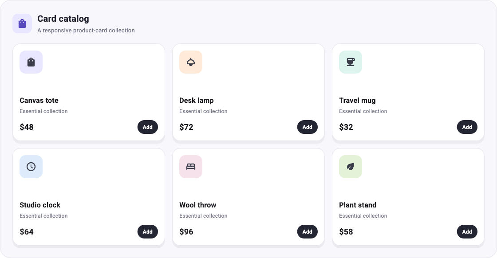
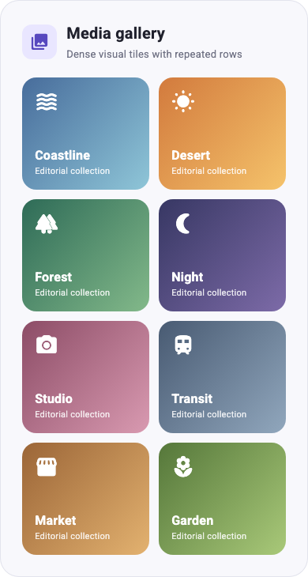

# Mix examples

These apps consume only Mix's public `package:mix/mix.dart` library.

Run the WrapBox gallery from this directory:

```sh
flutter run
```

Run the GridBox gallery with dashboard, card-catalog, and media-gallery use
cases:

```sh
flutter run -t lib/grid_main.dart
```

## GridBox

The Grid gallery switches between compact, medium, and wide parent widths. Its
styles use `onConstraints`, so each Grid responds to its own offered space
rather than the viewport:

```dart
final GridBoxStyler cardGrid = .columns([
  .fr(1),
  .fr(1),
  .fr(1),
]).gap(16).autoRows(.fixed(220)).onConstraints(
  .maxWidth(760),
  .columns([.fr(1), .fr(1)]).gap(12),
).onConstraints(
  .maxWidth(520),
  .columns([.fr(1)]).gap(10),
);

GridBox(style: cardGrid, children: cards);
```

The dashboard composes two independent GridBoxes: metrics transition from four
to two to one column, while the asymmetric report panels transition from two
columns to one.

<p>
  
  
</p>

The same track model handles repeated product cards and a denser media gallery:

<p>
  
  
</p>

## WrapBox

The primary example uses WrapBoxStyler's flattened fluent methods:

```dart
final style = WrapBoxStyler()
    .paddingAll(16)
    .spacing(8)
    .runSpacing(10)
    .wrapAlignment(WrapAlignment.center);
```

For advanced composition, `.flow(WrapStyler(...))` replaces or merges the
nested Wrap style directly. The name is `flow` because `.wrap()` is the Mix
widget-modifier API. On WrapBoxStyler, `.alignment()` and `.clipBehavior()`
belong to the outer Box; `.wrapAlignment()` and `.wrapClipBehavior()` belong
to Flutter's inner Wrap.

The widget tests include smoke coverage and deterministic responsive golden
images for both galleries:

```sh
flutter test
```
