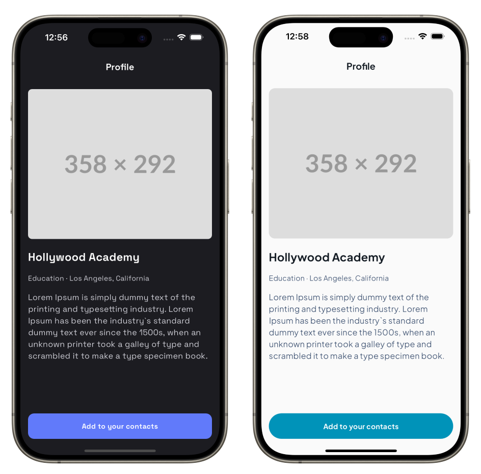
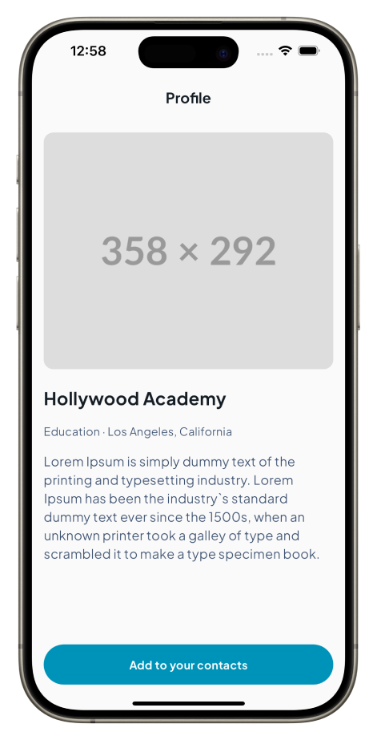

import { Bleed } from "nextra-theme-docs";

# Theming

## Introduction

Mix provides a powerful theming system that allows you to style your application consistently and efficiently, providing scalability and flexibility. The theming system is based on the concept of design tokens, which are key-value pairs that define visual properties like colors, text styles, and others. These tokens can be consistently applied across all your widgets, ensuring a consistent look and feel throughout your application. As a result, you can easily change the look and feel of your application by updating the design tokens, without having to modify each individual widget.

## Getting Started

For this guide we will create a multi-theme single screen app that will allow us to express the power of Mix's theming system. The final result will look like this:



As you can see in the image above, we have two different themes for the same screen, they are using different colors, text styles, fonts and border radius.
The left one is using a light theme with blue as primary color, so it will be called `lightBlueTheme`, and the right one is using a dark theme with purple as primary color, so its name will be `darkPurpleTheme`.

## Setting Up MixTheme

Before we begin styling our application with those themes, the first step is to configure the `MixTheme`. `MixTheme` serves as an ancestor widget that passes down the defined tokens to all its child widgets, ensuring they can access and utilize the same styling information. Setting up MixTheme correctly is key to leveraging the full power of the Mix package for your application's theming needs.

Here's how you can initialize and implement `MixTheme`:

### Wrapping the Root Widget

To apply your theme globally, you'll want to wrap your application's root widget with the `MixTheme` widget.

```dart
class MyApp extends StatelessWidget {
  const MyApp({super.key});

  @override
  Widget build(BuildContext context) {
    return MixTheme(
      data:
          lightBlueTheme, // <- MixThemeData (In this guide we are using the lightBlueTheme or darkPurpleTheme)
      child: const MaterialApp(
        home: ProfilePage(),
      ),
    );
  }
}
```

### Creating Design Tokens

Creating a `MixThemeData` instance is the next crucial step. But before we do that, you need to know how create your own design tokens. In Mix, there are five types of design tokens: `ColorToken`, `TextStyleToken`, `SpaceToken`, `RadiusToken`, and `BreakpointToken`. Each of these tokens represents a different type of design property, such as colors, text styles, spacing, border radii, and breakpoints. Then, to define is pretty simple, you just need instanciate the token with a unique name.

```dart
const primary = ColorToken('primary');
```

to create any other token, you can use the same pattern, just use the class that better represents the token you want to create. To make easier to use the tokens, we created a set of classes `TokenUtil` that can be extended, so you can create your own tokens and use them in a simple way.

```dart
extension ColorTokenUtilExt on ColorTokenUtil {
  ColorToken get primary => const ColorToken('primary-color');
  ColorToken get onPrimary => const ColorToken('on-primary-color');
  ColorToken get surface => const ColorToken('surface-color');
  ColorToken get onSurface => const ColorToken('on-surface-color');
  ColorToken get onSurfaceVariant =>
      const ColorToken('on-surface-variant-color');
}

extension TextStyleTokenUtilExt on TextStyleTokenUtil {
  TextStyleToken get headline1 => const TextStyleToken('headline1');
  TextStyleToken get headline2 => const TextStyleToken('headline2');
  TextStyleToken get headline3 => const TextStyleToken('headline3');
  TextStyleToken get body => const TextStyleToken('body');
  TextStyleToken get callout => const TextStyleToken('callout');
}
```

After that, you just need to use that variable `$token.{tokenCategory}` to access the design tokens. This happens because inside Mix framework, we already instanciated the `TokenUtil` classes.

```dart
final primaryColorToken = $token.color.primary;
final headline1TextStyleToken = $token.textStyle.headline1;
```

### Creating MixThemeData

This object defines the values for the design tokens that will be used throughout your application, as we mentioned before, the themeData is a set of key-value pairs where the key is the design token and the value is the actual value of the token. To define a `MixThemeData` instance, you can use the following code:

```dart
final lightBlueTheme = MixThemeData(
  colors: {
    $token.color.primary: const Color(0xFF0093B9),
    $token.color.onPrimary: const Color(0xFFFAFAFA),
    $token.color.surface: const Color(0xFFFAFAFA),
    $token.color.onSurface: const Color(0xFF141C24),
    $token.color.onSurfaceVariant: const Color(0xFF405473),
  },
  textStyles: {
    $token.textStyle.headline1: GoogleFonts.plusJakartaSans(
      fontSize: 22,
      fontWeight: FontWeight.bold,
    ),
    $token.textStyle.headline2: GoogleFonts.plusJakartaSans(
      fontSize: 18,
      fontWeight: FontWeight.bold,
    ),
    $token.textStyle.headline3: GoogleFonts.plusJakartaSans(
      fontSize: 14,
      fontWeight: FontWeight.bold,
    ),
    $token.textStyle.body: GoogleFonts.plusJakartaSans(
      fontSize: 16,
      fontWeight: FontWeight.normal,
    ),
    $token.textStyle.callout: GoogleFonts.plusJakartaSans(
      fontSize: 14,
      fontWeight: FontWeight.normal,
    ),
  },
  radii: {
    $token.radius.large: const Radius.circular(100),
    $token.radius.medium: const Radius.circular(12),
  },
  spaces: {
    $token.space.medium: 16,
    $token.space.large: 24,
  },
);
```

You could do the same for the `darkPurpleTheme`:

```dart
final darkPurpleTheme = MixThemeData(
  colors: {
    $token.color.primary: const Color(0xFF617AFA),
    $token.color.onPrimary: const Color(0xFFFAFAFA),
    $token.color.surface: const Color(0xFF1C1C21),
    $token.color.onSurface: const Color(0xFFFAFAFA),
    $token.color.onSurfaceVariant: const Color(0xFFD6D6DE),
  },
  textStyles: {
    $token.textStyle.headline1: GoogleFonts.spaceGrotesk(
      fontSize: 22,
      fontWeight: FontWeight.bold,
    ),
    $token.textStyle.headline2: GoogleFonts.spaceGrotesk(
      fontSize: 18,
      fontWeight: FontWeight.bold,
    ),
    $token.textStyle.headline3: GoogleFonts.spaceGrotesk(
      fontSize: 14,
      fontWeight: FontWeight.bold,
    ),
    $token.textStyle.body: GoogleFonts.spaceGrotesk(
      fontSize: 16,
      fontWeight: FontWeight.normal,
    ),
    $token.textStyle.callout: GoogleFonts.spaceGrotesk(
      fontSize: 14,
      fontWeight: FontWeight.normal,
    ),
  },
  radii: {
    $token.radius.large: const Radius.circular(12),
    $token.radius.medium: const Radius.circular(8),
  },
  spaces: {
    $token.space.medium: 16,
    $token.space.large: 24,
  },
);
```

## Creating UI

Now that we have our themes defined, we can start creating the UI for our application. We will create a simple profile page with an image and some text, and then apply the themes to the UI.

### Creating the components

The interface chosen for this guide is pretty simple, the unique custom component is a button, so let's create it first.

```dart
class ProfileButton extends StatelessWidget {
  const ProfileButton({
    super.key,
    required this.label,
  });

  final String label;

  @override
  Widget build(BuildContext context) {
    return Box(
      style: Style(
        $box.height(50),
        $box.width(double.infinity),
        $box.color.ref($token.color.primary),
        $box.alignment.center(),
        $box.borderRadius.all.ref($token.radius.large),
        $text.style.ref($token.textStyle.headline3),
        $text.style.color.ref($token.color.onPrimary),
      ),
      child: StyledText(
        label,
      ),
    );
  }
}
```

The code above illustrates a simple button created with Mix primitive widgets and previously defined tokens for styling. If you are already familiar with building components using Mix, There is only one thing you need to pay attention to: the attributes ending with the `of` method that are used to access the token values.

### Creating the ProfilePage

Now that we build the `ProfileButton`, we can create the `ProfilePage` widget.

```dart
class ProfilePage extends StatelessWidget {
  const ProfilePage({super.key});

  @override
  Widget build(BuildContext context) {
    return Scaffold(
      appBar: AppBar(
        backgroundColor: $token.color.surface.resolve(context),
        title: Text(
          'Profile',
          style: $token.textStyle.headline2.resolve(context).copyWith(
                color: $token.color.onSurface.resolve(context),
              ),
        ),
      ),
      backgroundColor: $token.color.surface.resolve(context),
      body: SafeArea(
        minimum: const EdgeInsets.all(16),
        child: Column(
          crossAxisAlignment: CrossAxisAlignment.start,
          children: [
            ClipRRect(
              borderRadius: BorderRadius.all(
                $token.radius.medium.resolve(context),
              ),
              child: Image.network(
                'https://placehold.co/358x292@2x.png',
              ),
            ),
            SizedBox(height: $token.space.large.resolve(context)),
            Text(
              'Hollywood Academy',
              style: $token.textStyle.headline1.resolve(context).copyWith(
                    color: $token.color.onSurface.resolve(context),
                  ),
            ),
            SizedBox(height: $token.space.medium.resolve(context)),
            Text(
              'Education · Los Angeles, California',
              style: $token.textStyle.callout.resolve(context).copyWith(
                    color: $token.color.onSurfaceVariant.resolve(context),
                  ),
            ),
            SizedBox(height: $token.space.medium.resolve(context)),
            Text(
              'Lorem Ipsum is simply dummy text of the printing and typesetting industry. Lorem Ipsum has been the industry`s standard dummy text ever since the 1500s, when an unknown printer took a galley of type and scrambled it to make a type specimen book.',
              style: $token.textStyle.body.resolve(context).copyWith(
                    color: $token.color.onSurfaceVariant.resolve(context),
                  ),
            ),
            const Spacer(),
            const ProfileButton(
              label: 'Add to your contacts',
            ),
          ],
        ),
      ),
    );
  }
}
```

The `ProfilePage` is not part of the design system, it's the why I'm not using the Mix primitive widgets to build it and it probably will be your case too. Mix is an awesome tool to style your components and make them more flexible, scalable and mantainable, but our goal is not to replace the Flutter widgets. It's important to say that because it creates a scenario where we need to use design tokens and transform them into values that can be used by the Flutter widgets, and that's why we are using the `resolve` method.

Now everything is set up, we can use the `ProfilePage` in our `MyApp` widget and see the result.



## One more thing... Material Design Tokens in Mix

You can also use the Material Design Tokens in Mix, they are already implemented and you can use them in your application, but stay aware that they just cover ColorScheme and TextTheme tokens.

Using the Material Design Tokens in Mix requires implementing the following `MixThemeData`:

#### Configure Material tokens

```dart
class MyApp extends StatelessWidget {
  @override
  Widget build(BuildContext context) {
    return MaterialApp(
      title: 'Mix App',
      home: MixTheme(
        data: MixThemeData.withMaterial(),
        child: ProfilePage(),
      ),
    );
  }
}
```

#### Using Material tokens

Mix provides an easy utility that you can use called `$md`, this is a namespace for all the Material Design tokens.

```dart
Box(
  style: Style(
    $text.style.ref($material.textTheme.headline1),
    $box.color.ref($material.colorScheme.primary),
  ),
  child: Text('Hello World'),
);
```
