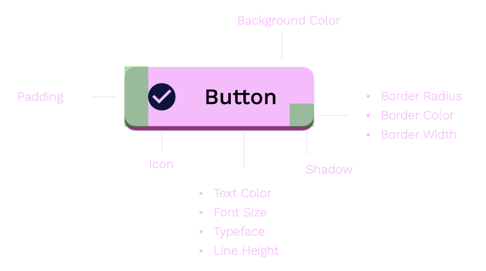
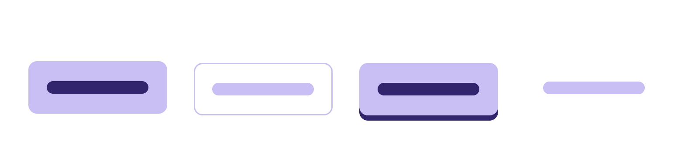
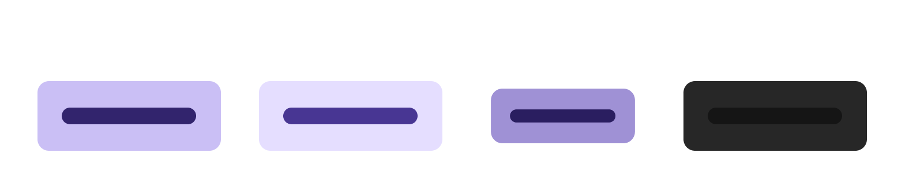
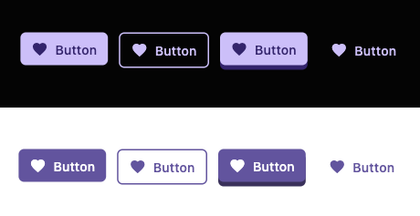

# Building a Design System Widget

When creating a design system in Flutter, building reusable components that maintain consistency and adhere to predefined design principles is crucial. In this guide, we'll explore the process of creating a button component for a design system, which will hopefully showcase the differences between building an individual widget.



## Component Overview

### Button Variants

A design system button should support multiple variants to cater to different use cases and visual styles. Common variants include:



- **Filled**: A button with a solid background color.
- **Outline**: A button with a transparent background and a visible border.
- **Elevated**: A button with a shadow effect to give it a raised appearance.
- **Link**: A button that looks like a clickable link, usually without a background or border.

Each variant should have a distinct visual style while maintaining consistency with the overall design system.

### States of a Button

To provide visual feedback to the user, each button variant should have well-defined states:



- **Normal**: The default state of the button.
- **Hover**: The state when the user hovers over the button or focuses on it using keyboard navigation.
- **Pressed**: The state when the button is actively being pressed.
- **Disabled**: The state when the button is non-interactive and cannot be clicked.

Implementing these states ensures that users have a clear understanding of the button's interactivity and current state.

### Shared Visual Attributes

While each button variant may have distinct visual characteristics, they should share common properties to maintain consistency across the design system. Some shared properties include:

- **Border Radius**: The roundness of the button's corners.
- **Color Palette**: The colors used for the button's background, text, and border should be derived from the design system's color palette.
- **Typography**: The font family, size, and weight used for the button's text should align with the design system's typography guidelines.
- **Padding and Spacing**: The internal padding and spacing between the button's text and its edges should be consistent across variants.

By sharing these properties, the button component ensures a cohesive and consistent appearance throughout the application.

## Setup Mix

1. Add the `mix` and `mix_annotations` packages to your Flutter project.

```bash
flutter pub add mix mix_annotations
```

2. Add the `mix_generator` and `build_runner` packages to your dev dependencies.

```bash
flutter pub add --dev mix_generator build_runner
```

After running these commands, your `pubspec.yaml` file should look similar to this:

```yaml
dependencies:
  flutter:
    sdk: flutter
  mix: ^1.0.0
  mix_annotations: ^1.0.0

dev_dependencies:
  flutter_test:
    sdk: flutter
  mix_generator: ^1.0.0
  build_runner: ^2.0.0
```

## Button Structure

Next, let's implement an example of a design system button.

### Structure Overview

Here is a simple example structure for a button.

- Container: Wraps the entire button and provides box decoration (border radius, background color, spacing).
- Flex: Arranges the icon and label horizontally within the button.
- Icon (optional): Represents an icon or visual embellishment for the button.
- Label: Displays the button's text content.

### Create a Button Spec

A Spec, which is short for Specification, is the visual properties and attributes that a Button can have. Since our structure contains a container, flex, icon, and label, we can define Mix Spec primitives for those widgets. That means a ButtonSpec can have attributes for Flex, Box, Text, and Icon, similar to the structure we have defined above.

This will look something like this:

```dart
import 'package:flutter/widgets.dart';
import 'package:mix/mix.dart';
import 'package:mix_annotations/mix_annotations.dart';

part 'button_spec.g.dart';

@MixableSpec()
class ButtonSpec extends Spec<ButtonSpec> with _$ButtonSpec {
  final FlexSpec flex;
  final BoxSpec container;
  final IconSpec icon;
  final TextSpec label;

  static const of = _$ButtonSpec.of;

  static const from = _$ButtonSpec.from;

  const ButtonSpec({
    BoxSpec? container,
    FlexSpec? flex,
    IconSpec? icon,
    TextSpec? label,
    super.animated,
  })  : flex = flex ?? const FlexSpec(),
        container = container ?? const BoxSpec(),
        icon = icon ?? const IconSpec(),
        label = label ?? const TextSpec();
}
```

As you can see, we are passing all optional parameters, but we do define defaults. It's important that the parameters of the constructor are nullable in order for the code generation to generate all the necessary code, attributes, and utilities. The reason Specs are always optional is due to how Mix works with composability; however, you can always set default values when resolving the Specs or applying them.

### Utility Generation

To generate the `button_spec.g.dart` file, run the following command in your terminal:

```bash
flutter pub run build_runner build
```

This command will generate the necessary code based on the annotations used in the `ButtonSpec` class.

After running the command, you should see a new file named `button_spec.g.dart` in the same directory as `button_spec.dart`. This generated file will contain the implementation details for the `_$ButtonSpec` mixin.

Note: After the `button_spec.g.dart` file is generated, you will notice that `mix_generator` has generated all the necessary extension methods, including:

- `lerp`: Linearly interpolates between two `ButtonSpec` instances.
- `copyWith`: Creates a new `ButtonSpec` instance with the specified properties replaced.
- `equality`: Equality comparison and hash code generation for `ButtonSpec` instances.
- `of` and `from` static methods: Helper methods for accessing and creating `ButtonSpec` instances.
  
Additionally, you will find the following generated classes:

- `ButtonSpecAttribute`: It is similar to `ButtonSpec`, but it has attribute equivalents, which allow values to be passed within Mix and merged before resolving to the spec.
- `ButtonSpecTween`: It is generated so you can use it for animations involving `ButtonSpec` instances.
- `ButtonSpecUtility`: This is the API utility class that you will be using to interact with your button. It provides convenient methods for applying the button's styling.

Make sure to run the build runner whenever you make changes to the `ButtonSpec` class or any other classes with Mix annotations to keep the generated code up to date.

### Define Variants

Inside the `button` folder, create a new file named `button_variants.dart`. Add the following code to `button_variants.dart`:

```dart
import 'package:mix/mix.dart';

class ButtonVariant extends Variant {
  const ButtonVariant._(super.name);

  static const filled = ButtonVariant._('filled');
  static const outlined = ButtonVariant._('outlined');
  static const elevated = ButtonVariant._('elevated');
  static const link = ButtonVariant._('link');
}
```

A variant is a very simple class that contains a name. This pattern allows creating a specific type of variant while having an API similar to an enum. However, a ButtonVariant also has a callable instance, so to apply styles only for that variant, you can do something like this within the style.

```dart
final style = Style(
  ButtonVariant.filled(
    // styles for filled variant
  ),
);
```

## Create the Button Widget

Let's define a `CustomButton` class that extends `StatelessWidget`. We will use the following properties:

- `label`: The button text (required).
- `disabled`: If the button is disabled (optional, default is `false`).
- `icon`: An optional icon next to the label (optional).
- `variant`: The button's visual style (optional, default is `ButtonVariant.filled`).
- `onPressed`: Callback function when pressed (required).
- `style`: Additional custom styling (optional).

With these properties in mind, here's the code for the `CustomButton` class:

```dart
class CustomButton extends StatelessWidget {
  const CustomButton({
    super.key,
    required this.label,
    this.disabled = false,
    this.icon,
    required this.onPressed,
    this.variant = ButtonVariant.filled,
    this.style,
  });

  final String label;
  final bool disabled;
  final IconData? icon;
  final ButtonVariant variant;
  final VoidCallback? onPressed;
  final Style? style;

  @override
  Widget build(BuildContext context) {
    return Pressable(
      onPress: disabled ? null : onPressed,
      enabled: !disabled,
      child: SpecBuilder(
        style: // Styles will go here
        builder: (context) {
          final button = ButtonSpec.of(context);

          return button.container(
            child: button.flex(
              direction: Axis.horizontal,
              children: [
                if (icon != null) button.icon(icon),
                if (label.isNotEmpty) button.label(label),
              ],
            ),
          );
      }),
    );
  }
}
```

Here's a breakdown of the `CustomButton` class implementation:

1. We define the `CustomButton` class with its constructor, which takes the required and optional properties we discussed earlier.
2. In the `build` method, we start by wrapping the button content with a `Pressable` widget. This widget is responsible for providing the button's interactive states, such as hover, pressed, and disabled. We set the `onPress` property to `onPressed` if the button is not disabled; otherwise, we set it to `null`. The `enabled` property is set to the opposite of `disabled`.
3. Inside the `Pressable`, we use a `SpecBuilder` widget. This widget is like a magic wand that transforms the style into a `ButtonSpec` that we can use to build our button. The `SpecBuilder` takes a builder function that gives us access to the `context`.
4. Within the builder function, we retrieve the `ButtonSpec` using `ButtonSpec.of(context)`. This is where the real fun begins! We can now use the `ButtonSpec` methods as if they were widgets to build our button's structure.
5. We start building the button structure using the `ButtonSpec` methods:
   - `button.container`: Container of the button, which we can customize using the `BoxSpec`.
   - `button.flex`: Flex layout of the button's content, and we can customize it using the `FlexSpec`.
   - `button.icon`: Optional icon. If the `icon` property is not null, we display the icon using this method and customize it with the `IconSpec`.
   - `button.label`: Button's label. If the `label` property is not empty, we display the label using this method and customize it with the `TextSpec`.

## Styling Your Button

Create a new file called `button_styles.dart`.

### Utilities

You can use the utility that was generated and create references for each part of the button like so:

```dart
final _util = ButtonSpecUtility.self;
final _label = _util.label;
final _container = _util.container;
final _flex = _util.flex;
final _icon = _util.icon;
```

### Design Tokens

Now, we will be using a few different colors. We can generate our own tokens, but for this example, we will be using `material` theme tokens.

Below your `MaterialApp` widget, add the `MixTheme`.

```dart
MixTheme(
  data: MixThemeData.withMaterial(),
  child: child,
)
```

Define the tokens in the file like so:

```dart
final _mdPrimary = $material.colorScheme.primary;
final _mdOnPrimary = $material.colorScheme.onPrimary;
final _mdButton = $material.textTheme.button;
```

Let's define our base style for the button:

```dart
Style get _baseStyle => Style(
  // Container 
  _container.borderRadius(6),
  _container.padding(8, 12),
  // Flex
  _flex.gap(8),
  _flex.mainAxisAlignment.center(),
  _flex.crossAxisAlignment.center(),
  _flex.mainAxisSize.min(),
  //Label
  _label.style.ref(_mdButton),
  // Icon
  _icon.size(18),
);
```

We have defined a `_baseStyle` that will be shared across all variants, and we use the generated utilities to add visual attributes to it.

- `container`: We define that a container will have a border radius of 6, and using the padding shorthand utility, we say that padding will be 8 vertically and 12 horizontally.
- `flex`: We also provide the flex attributes, including the gap between the children.
- `label`: For the label, we will use the `_mdButton` design token from the Material theme.
- `icon`: We defined a basic size for the icon.

### Styling Variants

Define the filled style:

```dart
Style get _filledStyle => Style(
  _container.color.ref(_mdPrimary),
  _label.style.color.ref(_mdOnPrimary),
  _icon.color.ref(_mdOnPrimary),
);
```

Next, create the elevated style by inheriting from `filled` and adding a shadow:

```dart
Style get _elevatedStyle => Style(
  _filledStyle(),
  _container.shadow.offset(0, 5),
  _container.shadow.color.ref(_mdPrimary),
  _container.shadow.color.darken(20),
);
```

Create the remaining variants for `outlined` and `link`:

```dart
Style get _outlinedStyle => Style(
  _container.color.transparent(),
  _container.border.width(1.5),
  _container.border.color.ref(_mdPrimary),
  _label.style.color.ref(_mdPrimary),
  _icon.color.ref(_mdPrimary),
);

Style get _linkStyle => Style(
  _outlinedStyle(),
  _container.border.style.none(),
  _container.color(Colors.transparent),
);
```

### Widget States Styling

Create state variants for different button states like `disabled`, `hover`, and `pressed`:

```dart
Style get _onDisabled => Style(
  _container.color.desaturate(100),
  _label.style.color.desaturate(100),
  _icon.color.desaturate(100),
  $with.opacity(0.5),
);

Style get _onHover => Style(
  _container.color.brighten(10),
  _label.style.color.brighten(10),
  _icon.color.brighten(10),
);

Style get _onPress => Style(
  _container.color.darken(10),
  _icon.color.darken(10),
  _label.style.color.darken(10),
  $with.scale(0.9),
);
```

You will see the usage of `Color` directives. These are color changes that happen when the color is resolved. Here we do not have to pass the color, as it will desaturate whatever color is at that attribute at that time.

We have also used two widget modifiers with the `$with` utility. These add a widget to the widget tree that wraps the button. In this case, when disabled, it will add an `Opacity()` widget with that value, and on press, you can see we will add a `Scale()` widget so it looks like the button is being pressed.

### Add All Styles Together

Create a function that brings all the button styles together:

1. One thing that Mix allows us to do is to override the styles or the variants at any time, so it's always good for the function to allow another style in case you need to override something within the widget from outside the widget.
2. You also want to accept a `ButtonVariant` as a parameter to the style in order to apply only the styles of that variant.

```dart
Style buttonStyle(Style? style, ButtonVariant? variant) {
  return Style(
    // Base shared style
    _baseStyle(),

    // Button Variants
    ButtonVariant.filled(_filledStyle()),
    ButtonVariant.outlined(_outlinedStyle()),
    ButtonVariant.elevated(_elevatedStyle()),
    ButtonVariant.link(_linkStyle()),

    // Widget state variants
    $on.disabled(_onDisabled()),
    $on.hover(_onHover()),
    $on.press(_onPress()),
    
    // Merge style if a style is provided
    // Apply variant
  ).merge(style).applyVariant(variant);
}
```We have leveraged the `ButtonVariants` we created to apply the styles only for them and used the `$on` utility to apply the styles for the widget states.

### Apply Style to the Button

Now all we have to do is call this function while passing the variant from the widget down on the `SpecBuilder`:

```dart
SpecBuilder(
  style: buttonStyle(style, variant),
  ...
```

And we are done. Now let's take a look at our buttons.

### Button Variant Widgets

If you don't want to pass the variant manually every time you use it, you can go ahead and create a new widget for each variant like this.

```dart
final class FilledButton extends CustomButton {
  const FilledButton({
    super.key,
    required super.label,
    super.disabled = false,
    super.icon,
    required super.onPressed,
    super.style,
  }) : super(variant: ButtonVariant.filled);
}

final class OutlinedButton extends CustomButton {
  const OutlinedButton({
    super.key,
    required super.label,
    super.disabled = false,
    super.icon,
    required super.onPressed,
    super.style,
  }) : super(variant: ButtonVariant.outlined);
}

final class ElevatedButton extends CustomButton {
  const ElevatedButton({
    super.key,
    required super.label,
    super.disabled = false,
    super.icon,
    required super.onPressed,
    super.style,
  }) : super(variant: ButtonVariant.elevated);
}

final class LinkButton extends CustomButton {
  const LinkButton({
    super.key,
    required super.label,
    super.disabled = false,
    super.icon,
    required super.onPressed,
    super.style,
  }) : super(variant: ButtonVariant.link);
}
```

## Results



```dart
// Main App
void main() {
  runApp(MyApp());
}

class MyApp extends StatelessWidget {
  @override
  Widget build(BuildContext context) {
    final icon = Icons.favorite;

    return MaterialApp(
      home: MixTheme(
        data: MixThemeData.withMaterial(),
        child: Scaffold(
          body: Padding(
            padding: const EdgeInsets.all(16.0),
            child: Row(
              crossAxisAlignment: CrossAxisAlignment.stretch,
              children: [
                FilledButton(
                  label: 'Button',
                  icon: icon,
                  onPressed: () {},
                ),
                SizedBox(height: 10),
                OutlinedButton(
                  label: 'Button',
                  icon: icon,
                  onPressed: () {},
                ),
                SizedBox(height: 10),
                ElevatedButton(
                  label: 'Button',
                  icon: icon,
                  onPressed: () {},
                ),
                SizedBox(height: 10),
                LinkButton(
                  label: 'Button',
                  icon: icon,
                  onPressed: () {},
                ),
              ],
            ),
          ),
        ),
      ),
    );
  }
}
```
